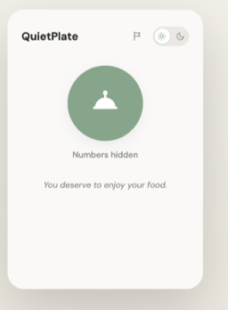

# QuietPlate

Browse menus peacefully with the QuietPlate Chrome extension. Calorie numbers are quietly tucked away.



## What it does

QuietPlate scans the page you're viewing and hides calorie numbers on restaurant and menu websites, so you can browse without them grabbing your attention. All scanning happens locally in your browser — page content is never sent anywhere.

- One-click toggle to turn the filter on or off from the popup
- Light and dark themes, matching your browser preference by default
- A report button for flagging a page where a calorie number slipped through or the filter didn't run — opens a pre-filled form with the page URL, nothing is sent unless you click it

## Installing

QuietPlate isn't published on the Chrome Web Store yet. Until then, you can load it as an unpacked extension:

1. Clone or download this repository
2. Open `chrome://extensions` in Chrome
3. Turn on "Developer mode" (top right)
4. Click "Load unpacked" and select this repository's folder

## Privacy

QuietPlate only stores your on/off and theme preferences on your device. See [PRIVACY.md](PRIVACY.md) for the full policy, including what the report feature sends and to whom.

## Testing

```
npm install
npm test
```
